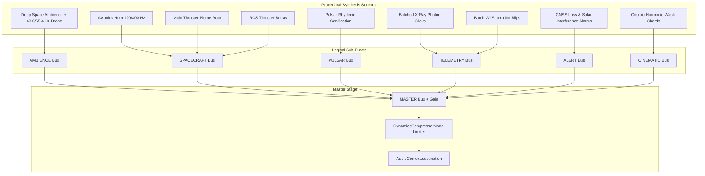

# PULSAR-X — Procedural Cinematic Audio Specification

**Version:** 1.0.0  
**Domain:** Cinematic Presentation & Sonification  
**Status:** APPROVED & IMPLEMENTED  

---

## 1. Executive Summary & Scientific Framing

> [!IMPORTANT]
> **Audio is an auditory presentation layer and does not represent literal acoustic propagation through vacuum.**  
> Outer space is an acoustic vacuum where mechanical sound waves cannot physically travel. All audio synthesized by PULSAR-X is strictly procedural **instrument sonification**, **onboard spacecraft avionics acoustics**, and **cinematic documentary presentation cues**.

> [!NOTE]
> **Pulsar sounds are sonifications derived from simulated timing behavior.**  
> Pulsars emit electromagnetic pulses (radio, optical, X-ray, gamma-ray). They do not emit audible acoustic waves. PULSAR-X maps simulated rotation frequencies ($\nu = 1/P$), pulse profiles, and photon arrivals into human-audible acoustic patterns to provide situational awareness and aesthetic depth.

The navigation solver terminology remains strictly:
$$\textbf{Iterative Batch Weighted Least Squares (Batch WLS) + RK4 Dead Reckoning}$$
No Kalman filters, IEKF, or fictional algorithms are implemented or sonified.

---

## 2. Audio Subsystem Architecture

The audio system resides under `src/cinematic/audio/` and is built entirely on the native **Web Audio API** without external audio files (`.wav`, `.mp3`, `.ogg`) or third-party audio libraries:

```
src/cinematic/audio/
├── audioTypes.ts           # Type definitions, mockable Web Audio interfaces, and configs
├── AudioBus.ts             # Logical bus abstraction with gain, mute, pan, and ramps
├── AudioMixer.ts           # Master mixer with soft-knee limiter and sub-bus routing
├── AudioClock.ts           # Consumes CinematicClock; handles playback rate and seeking
├── AudioSources.ts         # Procedural sound synthesizers (ambience, burns, clicks, alarms)
├── AudioProfiles.ts        # SceneAudioProfile definitions for all 18 scenes
├── AudioEventRouter.ts     # Subscribes to CinematicEventBus with duplicate suppression
├── AudioState.ts           # Reactive Zustand store for HUD and UI telemetry
├── CinematicAudioEngine.ts # Master singleton orchestrator
└── index.ts                # Public exports
```

---

## 3. Web Audio Graph & Hierarchical Buses



### Bus Responsibilities & Configurations
1. **`MASTER`**: Global gain control, master mute, soft-knee limiter (`DynamicsCompressorNode`: threshold -24 dB, knee 30, ratio 12, attack 3 ms, release 250 ms) to guarantee zero digital clipping.
2. **`AMBIENCE`**: Subliminal deep space bed (20–80 Hz low-pass filtered noise + dual sine drone at 43.65 Hz and 65.41 Hz).
3. **`SPACECRAFT`**: Onboard avionics hum (120 Hz + 400 Hz), TLI main engine rocket roar (dual bandpass 140/320 Hz noise + 55 Hz triangle rumble), and RCS bursts.
4. **`PULSAR`**: Rhythmic pulse train sonification with stereo spatialization per beacon.
5. **`TELEMETRY`**: Batch WLS computation ticks and batched photon arrival micro-transients.
6. **`ALERT`**: GNSS carrier loss dissonance (580/615 Hz dual sawtooth) and solar interference noise swells.
7. **`CINEMATIC`**: Harmonic resolution chord for navigation lock (220/330/440 Hz) and multi-octave galactic climax wash.

---

## 4. Pulsar Sonification Approach

Pulsars rotate at extreme speeds (e.g. PSR B1937+21 spins at ~641.9 Hz, period ~1.558 ms). Emitting a literal 641.9 Hz audio wave continuously would create a harsh, piercing tone. 

Instead, PULSAR-X employs **Subharmonic Divisor Sonification**:
- The simulated astronomical spin frequency $\nu_0$ is scaled by an integer subharmonic divisor $D$ to produce an intelligible human-audible rhythmic pulse frequency:
  $$f_{\text{rhythm}} = \frac{\nu_0}{D} \approx 10\text{ Hz}$$
- Each pulse emits a brief, formant-filtered transient shaped by the specific pulsar's identity and stereo position:

| Pulsar ID | Spin Freq ($\nu_0$) | Subharmonic Divisor ($D$) | Rhythmic Rate | Formants (Hz) | Stereo Pan | Sonic Character |
|---|---|---|---|---|---|---|
| **PSR B1937+21** | 641.93 Hz | 64 | 10.03 Hz | 1500, 3000 | -0.35 | Crisp, narrow X-ray click |
| **PSR B1821-24** | 327.41 Hz | 32 | 10.23 Hz | 850, 1700 | +0.35 | Warm, rounded pulse |
| **PSR J0437-4715** | 173.69 Hz | 16 | 10.85 Hz | 450, 900 | -0.65 | Low-mid resonant beacon |
| **PSR J0218+4232** | 430.46 Hz | 40 | 10.76 Hz | 600, 1200 | +0.65 | Dual harmonic chime |
| **PSR B0531+21** | 29.95 Hz | 1 | 29.95 Hz | 240, 480 | 0.00 | Rapid staccato throb |

---

## 5. Photon Arrival Event Batching

During active observation (Scene 10), thousands of X-ray photons arrive at the spacecraft detector. Allocating a Web Audio node for every photon would cause severe garbage collection spikes and drop frame rates.

**Aggregation Window ($T_{\text{batch}} = 35\text{ ms}$):**
- Photons arriving within the window are aggregated:
  $$N_{\text{batch}} = \sum_{t_i \in [t, t + T_{\text{batch}}]} 1$$
- A single micro-transient (12 ms sine blip at $2400 \pm 200\text{ Hz}$) is triggered with log-scaled amplitude:
  $$A_{\text{batch}} = \min\left(0.25, 0.08 + 0.06 \cdot \log_{10}(N_{\text{batch}} + 1)\right)$$
- This guarantees at most ~28 audio events per second regardless of photon flux density, protecting CPU and rendering performance.

---

## 6. Scene Audio Profiles (`SceneAudioProfile`)

Each of the 18 cinematic scenes defines an explicit mixing profile:

| Scene | Name | Ambience | Spacecraft | Pulsar | Telemetry | Alert | Cinematic | Active Sources |
|---|---|---|---|---|---|---|---|---|
| 01 | Earth Orbit Baseline | 0.30 | 0.50 | 0.00 | 0.40 | 0.00 | 0.00 | Ambience, Avionics |
| 02 | Translunar Injection | 0.40 | 0.85 | 0.00 | 0.30 | 0.00 | 0.25 | Ambience, TLI Burn, Avionics |
| 03 | Earth Recedes | 0.45 | 0.40 | 0.00 | 0.30 | 0.00 | 0.15 | Ambience, Avionics |
| 04 | Deep Space Silence | 0.60 | 0.35 | 0.00 | 0.25 | 0.00 | 0.10 | Ambience |
| 05 | GPS Carrier Lost | 0.45 | 0.30 | 0.00 | 0.20 | 0.80 | 0.30 | Ambience, GNSS Loss Alarm |
| 06 | Ground Link Lost | 0.65 | 0.25 | 0.00 | 0.15 | 0.60 | 0.20 | Ambience |
| 07 | Celestial Search | 0.50 | 0.30 | 0.20 | 0.30 | 0.00 | 0.20 | Ambience, Avionics |
| 08 | First Pulsar Discovery | 0.40 | 0.30 | 0.75 | 0.40 | 0.00 | 0.60 | Ambience, Pulsar Reveal |
| 09 | Pulsar Network | 0.40 | 0.30 | 0.70 | 0.45 | 0.00 | 0.40 | Ambience, Multi-Pulsar |
| 10 | Photon Observation | 0.35 | 0.30 | 0.65 | 0.65 | 0.00 | 0.35 | Ambience, Pulsars, Photon Clicks |
| 11 | Geometric Dilution | 0.55 | 0.30 | 0.45 | 0.50 | 0.20 | 0.30 | Ambience, Pulsars |
| 12 | WLS Convergence | 0.35 | 0.30 | 0.60 | 0.70 | 0.00 | 0.50 | Ambience, Pulsars, Nav Compute |
| 13 | Autonomous Position Lock | 0.30 | 0.30 | 0.50 | 0.40 | 0.00 | 0.75 | Ambience, Lock Chime |
| 14 | Solar Interference Anomaly | 0.45 | 0.30 | 0.20 | 0.25 | 0.85 | 0.40 | Ambience, Solar Glare Swell |
| 15 | Navigation Degradation | 0.60 | 0.30 | 0.30 | 0.35 | 0.55 | 0.25 | Ambience, Pulsars (3 active) |
| 16 | Autonomous Recovery | 0.35 | 0.30 | 0.65 | 0.55 | 0.00 | 0.70 | Ambience, Backup Lock Chime |
| 17 | Deep Space Destination | 0.40 | 0.35 | 0.45 | 0.35 | 0.00 | 0.55 | Ambience, Avionics |
| 18 | The Eternal Cosmic Clock | 0.30 | 0.20 | 0.55 | 0.25 | 0.00 | 0.95 | Ambience, Pulsars, Cosmic Climax |

---

## 7. Lifecycle, Autoplay & Seeking Safety

1. **User Gesture Unlock**: Browsers block audio before interaction. The "BEGIN MISSION" button in `PresentationOverlay.tsx` calls `defaultCinematicAudioEngine.unlock()`, resuming the `AudioContext` and starting ambience cleanly.
2. **Timeline Seeking**:
   - `onSeek(targetTime_s)` halts all one-shot sources (`mainEngine.stop()`, `alertTone.stopActiveAlarm()`, `photonClicker.reset()`).
   - Resets event debounce timestamps.
   - Smoothly updates bus gains to the target scene profile.
   - Zero runaway oscillators or volume compounding when scrubbing back and forth.
3. **Playback Rate Scaling**:
   - When playback rate increases (e.g. 2x, 5x), pulsar pulse intervals scale proportionally, with an internal rate limiter clamped at 2.0x to prevent acoustic distortion or aliasing.
4. **Disposal**:
   - When the cinematic finishes or the user exits, `defaultCinematicAudioEngine.stop()` halts all sources and mutes buses gracefully.
