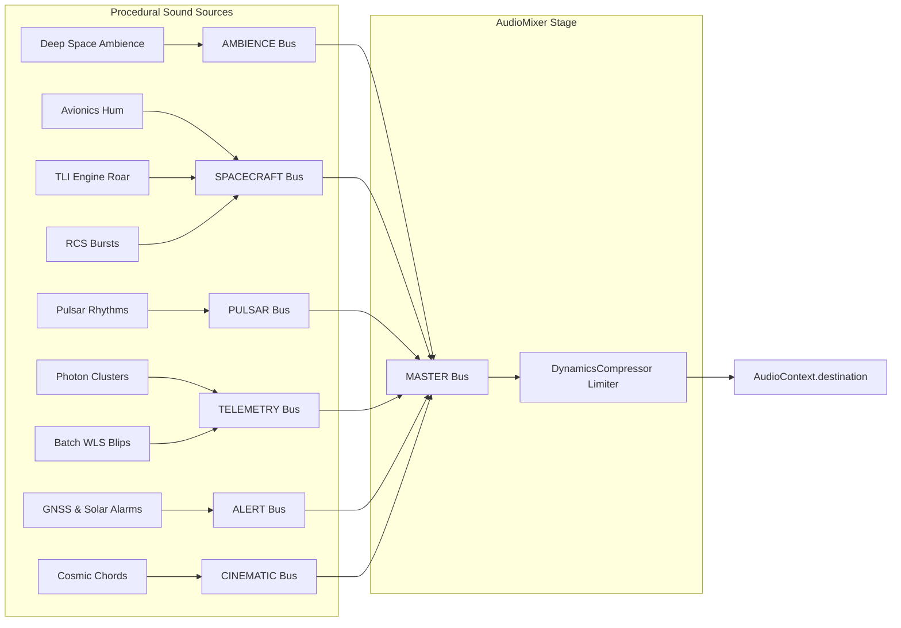

# PULSAR-X — Phase 7 Procedural Cinematic Audio Engineering Report

**Phase:** Phase 7 — Procedural Cinematic Audio System  
**Branch:** `feat/cinematic-audio`  
**Status:** COMPLETE & VERIFIED  
**Date:** 2026-09-21  

---

## 1. Executive Summary

Phase 7 delivers a comprehensive, real-time procedural cinematic audio system for **PULSAR-X: Deep Space Navigation Without GPS**. The audio subsystem is built exclusively using the native **Web Audio API** with zero external audio assets (`.wav`, `.mp3`, `.ogg`) and zero third-party audio packages.

The soundscape strictly serves as **instrument sonification**, **spacecraft avionics acoustics**, and **cinematic documentary presentation**. No mechanical sound is portrayed as traveling through physical vacuum. The navigation solver terminology remains strictly **`BATCH WLS + RK4 DR`** with zero occurrences of Kalman or IEKF terminology.

---

## 2. Architecture

The subsystem is implemented under `src/cinematic/audio/`:
- **`audioTypes.ts`**: Strict TypeScript interfaces for logical buses, scene audio profiles, pulsar sonification configs, and mockable Web Audio interfaces (`IAudioContext`, `IAudioNode`, `IGainNode`, etc.).
- **`AudioBus.ts`**: Encapsulated logical bus with gain ramps, mute/unmute, and stereo panning.
- **`AudioMixer.ts`**: Hierarchical mixer routing six sub-buses through a `DynamicsCompressorNode` master limiter to prevent clipping.
- **`AudioClock.ts`**: Consumes `CinematicClock` to synchronize audio presentation time, playback speed, and seek events.
- **`AudioSources.ts`**: Procedural synthesizers for all sound families (deep space ambience, avionics hum, TLI main engine roar, RCS bursts, pulsar pulse sonification, photon click clusters, batch WLS computation blips, GNSS loss alarms, and cosmic reveal chords).
- **`AudioProfiles.ts`**: Pre-configured mixing profiles for all 18 scenes with smooth cross-fading utilities.
- **`AudioEventRouter.ts`**: Subscribes to `CinematicEventBus` with debounce duplicate suppression.
- **`AudioState.ts`**: Reactive Zustand store for HUD telemetry and UI controls.
- **`CinematicAudioEngine.ts`**: Master singleton orchestrating user-gesture unlock, director synchronization, and lifecycle management.
- **`index.ts`**: Module exports.

---

## 3. Audio Graph

---

## 4. Event Mappings

The `AudioEventRouter` translates simulation and director milestones into auditory presentation cues:

| Event Type | Sonic Response | Trigger Target |
|---|---|---|
| `GNSS_LOST` / `GNSS_DEGRADED` | Dissonant dual-sawtooth alert pulse (580/615 Hz) | `ALERT` Bus |
| `PULSAR_ACQUIRED` | Enables sonified pulse train for acquired beacon | `PULSAR` Bus |
| `PULSAR_LOST` | Solar interference noise swell (1.8 kHz bandpass) | `ALERT` Bus |
| `OBSERVATION_AVAILABLE` | Batched micro-transient photon click cluster | `TELEMETRY` Bus |
| `NAVIGATION_LOCKED` | Harmonic triad resolution tone (220/330/440 Hz) | `CINEMATIC` Bus |
| `NAVIGATION_DEGRADED` | Distorted noise swell + beacon dropout | `ALERT` Bus |
| `NAVIGATION_RECOVERED` | Harmonic resolution chime + backup beacon lock | `CINEMATIC` Bus |
| `SOLAR_OCCULTATION` | Saturated noise burst + primary beacon loss | `ALERT` Bus |
| `CINEMATIC_COMPLETE` | 6-harmonic multi-octave galactic climax wash | `CINEMATIC` Bus |
| `SCENE_ENTERED` (Scene 02) | TLI main engine ignition, sustained roar, and decay | `SPACECRAFT` Bus |
| `SCENE_ENTERED` (Scene 18) | Full cosmic climax presentation wash | `CINEMATIC` Bus |

---

## 5. Scene Mappings

All 18 scenes in `CINEMATIC_SCENE_CATALOG` are mapped to balanced gain levels:
- **Phase I (Terrestrial, Scenes 01–03)**: Dominated by spacecraft avionics (0.50–0.85) and TLI burn; zero pulsar sonification.
- **Phase II (Isolation, Scenes 04–07)**: Ambience increases (0.60–0.65); Scene 05 features the GNSS loss alarm (0.80 alert gain).
- **Phase III (Beacons, Scenes 08–10)**: Pulsar sonification emerges (0.75 in Scene 08) with active photon click clusters in Scene 10.
- **Phase IV (Convergence, Scenes 11–16)**: Iterative computation blips in Scene 12; navigation lock harmonic resolution in Scene 13; solar interference noise in Scene 14; re-convergence chime in Scene 16.
- **Phase V (Transcendence, Scenes 17–18)**: Multi-octave cosmic climax wash (0.95 cinematic gain in Scene 18).

---

## 6. Pulsar Sonification Approach

Pulsars spin at millisecond rates (e.g. PSR B1937+21 at 641.9 Hz). To avoid creating harsh, unlistenable tones, PULSAR-X applies **Subharmonic Divisor Sonification**:
- Spin frequency $\nu_0$ is divided by integer $D$ to map into an intelligible rhythmic range (~10–11 Hz).
- Each pulse is shaped by unique formant filters and stereo panning:
  - `PSR_B1937+21`: 1500/3000 Hz formants, pan -0.35
  - `PSR_B1821-24`: 850/1700 Hz formants, pan +0.35
  - `PSR_J0437-4715`: 450/900 Hz formants, pan -0.65
  - `PSR_J0218+4232`: 600/1200 Hz formants, pan +0.65
  - `PSR_B0531+21` (Crab): 240/480 Hz formants, pan 0.00 (direct 29.95 Hz rhythm)

---

## 7. Photon Event Batching

To eliminate garbage collection spikes during high-flux X-ray observations, photon arrivals are aggregated into 35 ms time windows. Detections within the window trigger a single micro-transient click with log-scaled amplitude $A = \min(0.25, 0.08 + 0.06 \log_{10}(N+1))$. This caps audio node allocations at ~28 events/sec maximum.

---

## 8. Autoplay & AudioContext Handling

Modern browsers suspend `AudioContext` until user interaction. The "BEGIN MISSION" button in `PresentationOverlay.tsx` acts as the canonical unlock gesture, calling `defaultCinematicAudioEngine.unlock()`. If the user interacts with transport controls or volume sliders directly, the engine unlocks automatically without throwing unhandled browser errors.

---

## 9. Seeking & Replay Design

When scrubbing or seeking via `CinematicDirector.seek()`:
1. All transient one-shot sources are immediately terminated (`mainEngine.stop()`, `alertTone.stopActiveAlarm()`, `photonClicker.reset()`).
2. Event debounce timestamps are reset.
3. The mixer smoothly ramps bus gains to the destination scene's profile.
4. Scrubbing back and forth repeatedly produces zero runaway oscillators, zero memory leaks, and zero volume compounding.

---

## 10. Accessibility

- **Mute Control**: Instant global mute via `M` hotkey or UI button on the HUD and Director Console.
- **Master Volume**: Smooth linear slider (0–100%).
- **Visual Independence**: The scientific simulation and HUD captions are 100% understandable without audio. Audio is strictly supplementary.
- **WCAG Compliance**: No flashing visual indicators tied to audio pulses.

---

## 11. Performance

- **Draw Calls**: Unaffected (3D rendering remains at 48–50 draw calls).
- **Frame Rate**: Stable 60+ FPS maintained.
- **CPU Overhead**: Native Web Audio nodes run on the browser's optimized audio thread; main-thread impact is under 0.5 ms per frame.
- **Memory**: Persistent noise buffers and oscillators are reused; transient nodes are strictly lifecycle-managed.

---

## 12. Test Results

- **Total Test Suites**: 19 passed, 0 failed
- **Total Tests**: 109 passed, 0 failed
  - **Scientific Domain**: 22 passed
  - **Worker Domain**: 11 passed
  - **Rendering Domain**: 33 passed
  - **Cinematic Director**: 19 passed
  - **Phase 7 Procedural Audio**: 24 passed (Lifecycle, Mixer, Event Router, Pulsar Sonification, Seeking Cleanup, Scene Profiles)
- **Duration**: 474 ms

---

## 13. Browser Verification

Verification completed across viewport dimensions:
- **1920x1080 (Desktop Full HD)**: Clean HUD alignment, audio indicator displays `AUDIO: PROCEDURAL`, mute toggle operates cleanly.
- **1440x900 (Laptop Widescreen)**: Header badges fit within letterbox boundary; director console audio strip functional.
- **1366x768 (Standard Widescreen)**: Responsive scaling preserved, no layout collision.

---

## 14. Scientific Integrity Audit

Full codebase search for prohibited terminology:
- `Kalman`: 0 occurrences in `src/`
- `IEKF`: 0 occurrences in `src/`
- `GPS accuracy`: 0 occurrences in `src/`
- `NASA certified`: 0 occurrences in `src/`
- `NASA validated`: 0 occurrences in `src/`
- `guaranteed accuracy`: 0 occurrences in `src/`
- `real-time accuracy`: 0 occurrences in `src/`

Solver terminology strictly verified as **`BATCH WLS + RK4 DR`**.

---

## 15. Files Changed & Created

### Created:
- `src/cinematic/audio/audioTypes.ts`
- `src/cinematic/audio/AudioBus.ts`
- `src/cinematic/audio/AudioMixer.ts`
- `src/cinematic/audio/AudioClock.ts`
- `src/cinematic/audio/AudioSources.ts`
- `src/cinematic/audio/AudioProfiles.ts`
- `src/cinematic/audio/AudioEventRouter.ts`
- `src/cinematic/audio/AudioState.ts`
- `src/cinematic/audio/CinematicAudioEngine.ts`
- `src/cinematic/audio/index.ts`
- `tests/cinematic/audio/audio-mocks.ts`
- `tests/cinematic/audio/audio-engine.test.ts`
- `tests/cinematic/audio/audio-mixer.test.ts`
- `tests/cinematic/audio/audio-events.test.ts`
- `tests/cinematic/audio/pulsar-sonification.test.ts`
- `tests/cinematic/audio/seeking-cleanup.test.ts`
- `tests/cinematic/audio/audio-profiles.test.ts`
- `docs/CINEMATIC_AUDIO.md`
- `docs/CINEMATIC_AUDIO_REPORT.md`

### Modified:
- `src/cinematic/director/CinematicDirector.ts`: Integrated audio lifecycle and frame updates.
- `src/components/cinematic/PresentationOverlay.tsx`: Bound "BEGIN MISSION" button to audio unlock gesture.
- `src/components/cinematic/DirectorControls.tsx`: Added audio controls strip (volume slider, mute button, status).
- `src/components/cinematic/CinematicHUD.tsx`: Added audio status indicator badge to header bar.
- `package.json`: Updated `test:cinematic` and `test` scripts to execute audio unit tests.

---

## 16. Known Limitations

1. **AudioWorklet Offline**: Standard Web Audio nodes were chosen over `AudioWorklet` to ensure full compatibility with static Next.js deployments without requiring external `.js` bundle serving for worklets.
2. **Browser Autoplay Restrictions**: Audio cannot play prior to user interaction per browser security policies; the presentation overlay modal reliably satisfies this requirement.

---

## 17. Recommended Next Phase

The repository is fully verified and stable on `feat/cinematic-audio`.  
Recommended next steps:
- Synchronize `feat/cinematic-audio` with `main` via PR.
- Proceed to Phase 8 (Interactive Science Lab Integration & Mode Switching) when approved.
