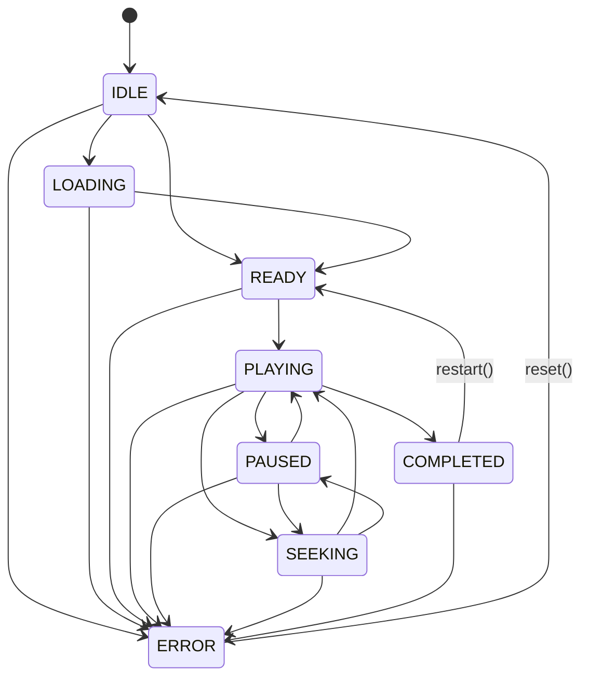

# PULSAR-X: Cinematic Director & Film Experience Architecture

## 1. Executive Summary & Philosophy

The **Cinematic Director** transforms the real-time 3D scientific simulation of **PULSAR-X** into a film-like interactive narrative. Combining the aesthetics of serious space cinema (*Interstellar*, *2001*), authentic NASA mission visualizations (SEXTANT/NICER, Apollo 11), and interactive scientific instrumentation, the Director orchestrates camera choreography, visual look-development, narrative pacing, and layered HUD telemetry.

### Non-Negotiable Scientific Integrity Rule
**The simulation is the ground truth. The Cinematic Director is strictly a presentation layer.**
The Director controls:
- Camera paths, FOV, and framing compositions
- Narrative captions and lower-third typography
- HUD transitions and central alert overlays
- Visual themes and effects intensity within calibrated bounds
- Simulation playback multipliers ($1\times\text{–}50\times$) for time-compressed scenes

The Director **never fabricates or spoofs**:
- Spacecraft position, velocity, or trajectory
- GDOP or geometric dilution metrics
- Navigation error or covariance ellipsoids
- Pulsar rotational phases, frequencies, or photon counts
- Solver convergence status or post-fit residuals

### Numeric Classification Convention
Every numerical figure displayed in the cinematic experience is explicitly classified:
- `[REAL_INPUT]`: True physical or astronomical constants (e.g., speed of light $c$, pulsar spin periods $P$, catalog sky coordinates $\alpha, \delta$).
- `[SIMULATION_OUTPUT]`: Dynamic values generated live by the simulation worker (e.g., true spacecraft state, position error, covariance trace, instantaneous GDOP, photon counts, SNR).
- `[SCENARIO_TARGET]`: Scripted operational goals and milestone thresholds driving narrative progression (e.g., target insertion accuracy, distance trigger for GPS loss).
- `[DISPLAY_SCALE]`: Coordinate and geometry scaling factors applied strictly for Three.js viewport rendering.
- `[ARTISTIC_APPROXIMATION]`: Stylized cinematography values (e.g., camera lens FOV, lighting intensities, particle densities).

---

## 2. Architecture & Domain Structure

The cinematic engine is organized under `src/cinematic/`:

```
src/cinematic/
  director/
    CinematicDirector.ts      # Master singleton orchestrator
    CinematicTimeline.ts      # Scene sequencing and playhead calculations
    CinematicClock.ts         # Triple-clock decoupling (wall, sim, playhead)
    CinematicEventBus.ts      # Strongly typed scientific & cinematic event bus
    DirectorState.ts          # Explicit 8-state finite state machine
  scenes/
    types.ts                  # SceneDefinition, SceneHUDConfig, SceneActions
    catalog.ts                # Ordered sequence of all 18 scenes
    scene01-earth.ts ... scene18-final-reveal.ts
  shots/
    types.ts                  # ShotDefinition, camera choreography params
  transitions/
    types.ts                  # CUT, FADE, DISSOLVE, WHIP_PAN, ZOOM, etc.
  triggers/
    types.ts                  # TELEMETRY_TRIGGER, EVENT_TRIGGER, PLAYHEAD_TRIGGER
```

---

## 3. Director State Machine (`DirectorState.ts`)

The director executes an explicit 8-state finite state machine with strict transition guards:



Invalid transitions throw structured `DirectorStateError` instances.

---

## 4. Clock Decoupling (`CinematicClock.ts`)

The Director maintains strict separation between three distinct clocks:
1. **Wall Clock ($t_{\text{wall}}$):** Diagnostic real-time timestamp in milliseconds (never fed to scientific calculations).
2. **Simulation Clock ($t_{\text{sim}}$):** Authoritative coordinate time generated by the Web Worker simulation runtime.
3. **Cinematic Playhead ($t_{\text{playhead}}$):** Presentation sequence time ($0 \le t_{\text{playhead}} \le T_{\text{total}}$), advancing according to director playback rate ($0.5\times\text{–}10\times$).

---

## 5. Event Bus & Trigger Priority (`CinematicEventBus.ts` & `triggers/types.ts`)

Events originate from genuine Web Worker state transitions (`WORKER_EVENT`) and director milestones:
- `SIMULATION_READY`
- `GNSS_DEGRADED`, `GNSS_LOST`
- `GROUND_LINK_LOST`
- `PULSAR_ACQUIRED`, `PULSAR_LOST`
- `OBSERVATION_AVAILABLE`
- `NAVIGATION_DEGRADED`, `NAVIGATION_RECOVERED`, `NAVIGATION_LOCKED`
- `SOLAR_OCCULTATION`
- `MISSION_ARRIVAL`
- `CINEMATIC_COMPLETE`

### Trigger Priority Resolution
When evaluating scene transitions and dramatic beats, the Director enforces strict hierarchy:
$$\text{EVENT\_TRIGGER} (100+) > \text{TELEMETRY\_TRIGGER} (50\text{–}99) > \text{PLAYHEAD\_TRIGGER} (10\text{–}49) > \text{MANUAL\_TRIGGER} (0)$$

This guarantees that physical reality and genuine simulation milestones always take precedence over simple elapsed timers.

---

## 6. The 18-Scene Narrative Sequence

| # | Scene Key | Narrative Phase | Camera Preset | Visual Theme | Core Milestone |
|---|---|---|---|---|---|
| **01** | `SCENE_01_EARTH` | I: Terrestrial | `EARTH_ORBIT` | `NOMINAL` | LEO baseline; GNSS locked (12 SVs); error $\pm 1.2\text{ m}$. |
| **02** | `SCENE_02_DEPARTURE` | I: Terrestrial | `EARTH_DEPARTURE` | `NOMINAL` | Translunar escape burn ($\Delta V +3{,}150\text{ m/s}$); hyperbolic trajectory. |
| **03** | `SCENE_03_EARTH_RECEDES`| I: Terrestrial | `EARTH_ORBIT` | `NOMINAL` | Cislunar transit ($120{,}000\text{ km}$); Earth becomes a pale blue marble. |
| **04** | `SCENE_04_DEEP_SPACE` | I: Terrestrial | `SPACECRAFT_HERO` | `NOMINAL` | Interplanetary medium ($0.98\text{ AU}$); quiet isolation. |
| **05** | `SCENE_05_GPS_LOST` | II: Isolation | `SPACECRAFT_HERO` | `DEGRADED` | GPS carrier lock drops below threshold; GDOP $\to \infty$. |
| **06** | `SCENE_06_GROUND_LINK_LOST`| II: Isolation | `SPACECRAFT_HERO` | `DEGRADED` | DSN uplink blackout ($0.0\text{ bps}$); switching to 100% autonomous navigation. |
| **07** | `SCENE_07_SEARCH` | II: Isolation | `SPACECRAFT_HERO` | `NOMINAL` | Autonomous celestial sky survey across equatorial coordinates $(\alpha, \delta)$. |
| **08** | `SCENE_08_FIRST_PULSAR` | III: Beacons | `PULSAR_REVEAL` | `CINEMATIC` | Hyper-zoom reveal of PSR B1937+21 ($\nu = 641.928\text{ Hz}$). |
| **09** | `SCENE_09_PULSAR_NETWORK`| III: Beacons | `NETWORK_OVERVIEW`| `CINEMATIC` | 4-pulsar non-coplanar tetrahedral constellation; GDOP $\approx 2.1$. |
| **10** | `SCENE_10_OBSERVATION` | III: Beacons | `SPACECRAFT_HERO` | `NOMINAL` | Sparse photon arrival accumulation and epoch folding into pulse profile. |
| **11** | `SCENE_11_UNCERTAINTY` | IV: Convergence | `UNCERTAINTY_CLOSE`| `DEGRADED` | Large covariance uncertainty ellipsoid ($\pm 42.5\text{ km}$) under dead reckoning. |
| **12** | `SCENE_12_CONVERGENCE` | IV: Convergence | `UNCERTAINTY_CLOSE`| `NOMINAL` | Relativistic Rømer corrections applied; WLS solver collapses error ellipsoid. |
| **13** | `SCENE_13_POSITION_LOCK`| IV: Convergence | `SPACECRAFT_HERO` | `LOCKED` | Autonomous celestial lock confirmed; position error $\le 1.8\text{ km}$. |
| **14** | `SCENE_14_SIGNAL_FAILURE`| IV: Convergence | `SOLAR_INTERFERENCE`| `CRITICAL` | Solar flare occults primary beacon; GDOP degrades to $18.4$. |
| **15** | `SCENE_15_DEGRADATION` | IV: Convergence | `UNCERTAINTY_CLOSE`| `DEGRADED` | Covariance growth along unconstrained axis under dead reckoning. |
| **16** | `SCENE_16_RECOVERY` | IV: Convergence | `NETWORK_OVERVIEW`| `NOMINAL` | Autonomous acquisition of backup pulsar PSR J0218+4232; lock restored. |
| **17** | `SCENE_17_DESTINATION` | V: Transcendence | `DESTINATION_APPROACH`| `CINEMATIC` | Target arrival at $5.2\text{ AU}$; autonomous insertion nominal ($412\text{ days}$ without GPS). |
| **18** | `SCENE_18_FINAL_REVEAL` | V: Transcendence | `NETWORK_OVERVIEW`| `CINEMATIC` | Galactic scale pullback; *"The stars can be the GPS"*. |

---

## 7. Camera & Controller Integration (`CameraController.ts`)

The Director integrates seamlessly with the existing `CameraController`:
- `setDirectorMode(true)`: Locks user OrbitControls and grants exclusive, deterministic control to the director.
- `applyShot(shot, context)`: Evaluates position and target from scene context, and smoothly interpolates camera position, lookAt, and FOV over the shot duration using cubic ease-in-out.
- `exit()`: Smoothly returns OrbitControls and camera interaction to the user.

---

## 8. User Interaction & Hotkeys

During cinematic playback, users retain intuitive keyboard control:
- **`SPACE`**: Play / Pause presentation
- **`R`**: Restart mission from Scene 01
- **`ESC`**: Exit Cinematic mode into Free Orbit exploration
- **`→`**: Skip to next scene
- **`←`**: Skip to previous scene
- **`M`**: Toggle audio mute hook (prepared for Phase 7)
- **`L`**: Enter Science Lab mode hook
