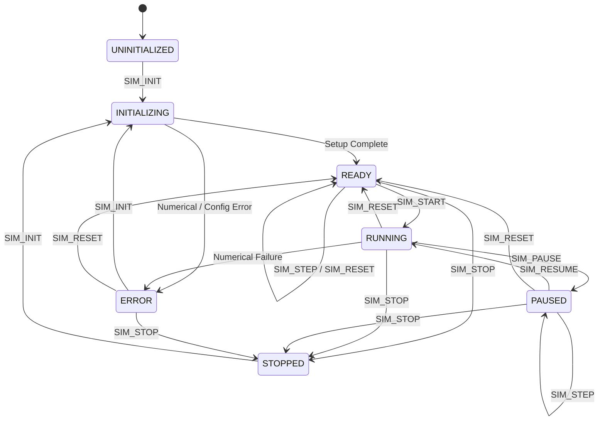

# PULSAR-X — Web Worker Architecture & Real-Time Execution Layer

**Document Status:** Complete & Verified  
**Phase:** Phase 3 — Simulation Web Worker + Real-Time Execution Layer  
**Authoritative Location:** `docs/WORKER_ARCHITECTURE.md`  
**Implementation Modules:**  
- `src/workers/protocol.ts` (Command discriminated unions, lifecycle states, fault schemas)  
- `src/workers/telemetry.ts` (Numerical frames, analytical history, binary layout)  
- `src/workers/simulation-runtime.ts` (Headless orchestrator of scientific engine)  
- `src/workers/simulation.worker.ts` (Web Worker entry point)  
- `src/workers/simulation-client.ts` (Main-thread client with typed subscriptions)  
**Test Suite:** `tests/workers/` (`npm test`)

---

## 1. Architectural Philosophy & Separation of Concerns

The PULSAR-X Web Worker execution layer encapsulates all numerical integration, stochastic photon generation, TOA extraction, and navigation filtering into a dedicated thread. 

```
┌─────────────────────────────────────────────────────────────────────────┐
│ MAIN THREAD (UI / Presentation Layer)                                   │
│  - React 19 / Next.js 16 Client Orchestrator                            │
│  - React Three Fiber / Three.js 0.186 Scene Graph                       │
│  - Zustand Telemetry Store (throttled subscriptions)                    │
│  - SimulationClient API (command dispatch & message routing)            │
└───────────────────┬─────────────────────────────────▲───────────────────┘
                    │ WorkerCommand                   │ WorkerToMainMessage
                    │ (SIM_INIT, SIM_STEP, etc.)      │ (Telemetry, Events)
┌───────────────────▼─────────────────────────────────┴───────────────────┐
│ WEB WORKER THREAD (simulation.worker.ts)                                │
│  - SimulationRuntime (Single source of truth)                           │
│  - Strict Lifecycle State Machine                                      │
│  - Independent Simulation Clock & Deterministic Sub-Stepping            │
│  - Fixed Timestep (dt = 0.05s) Physics Loop                             │
│  - Reference Scientific Core Orchestration (src/simulation/)            │
│    ├── OrbitPropagator (6-DoF RK4 Gravity Monopole + Perturbations)     │
│    ├── ClockModel (Phase & Frequency Random Walk Integration)           │
│    ├── Inhomogeneous Poisson Photon Arrival Simulators                  │
│    ├── Epoch Phase Folding & Cross-Correlation TOA Estimator            │
│    ├── Gauss-Newton Non-Linear Batch Least Squares Solver               │
│    └── Error Ellipsoid Decomposition (Classical Jacobi Eigenvalues)     │
└─────────────────────────────────────────────────────────────────────────┘
```

### Critical Architectural Invariants
1. **Zero Scientific Duplication:** The Worker does NOT reimplement physics equations. It orchestrates the tested Phase 2 modules in `src/simulation/`.
2. **Deterministic Simulation Clock:** Simulation time $t_{sim}$ is strictly decoupled from wall-clock time $t_{wall}$. Time acceleration (playback multiplier) changes how fast simulation time progresses relative to wall time without modifying scientific equations.
3. **Controlled Telemetry Cadence:** Telemetry emissions are aggregated and throttled (20 Hz for numerical transforms, 1 Hz for analytical charts) to prevent flooding `postMessage`.
4. **Binary Preparedness:** High-frequency numerical telemetry maps directly to a contiguous 34-element `Float64Array` (272 bytes) for future transferable `ArrayBuffer` transmission.

---

## 2. Worker Lifecycle State Machine

The Worker operates under a strict finite state machine with zero implicit transitions.



### Transition Guard Rules
- Any command received in an incompatible lifecycle state (e.g. `SIM_START` when `UNINITIALIZED`) is rejected immediately with an explicit structured `WORKER_ERROR` message (`category: 'INVALID_COMMAND'`), leaving the active state unchanged.
- State changes trigger a broadcast `STATE_CHANGED` message with `previousState` and `state`.

---

## 3. Command Protocol Specification

Commands dispatched from the Main Thread to the Worker use a strict TypeScript discriminated union:

| Command | Payload Structure | Semantics |
| :--- | :--- | :--- |
| `SIM_INIT` | `{ seed?: number; config?: Partial<SimulationConfig>; scenarioId?: string; initialSpacecraftState?: SpacecraftState; initialClockState?: ClockState; playbackMultiplier?: number; telemetryInterval_ms?: number; }` | Transitions to `INITIALIZING`, constructs PRNG, initializes orbital/clock states, sets up epoch folders, and transitions to `READY`. |
| `SIM_START` | None | Starts continuous background execution timer. State $\to$ `RUNNING`. |
| `SIM_PAUSE` | None | Stops timer loop. State $\to$ `PAUSED`. Preserves current simulation state. |
| `SIM_RESUME` | None | Resumes timer loop from current state. State $\to$ `RUNNING`. |
| `SIM_STEP` | `{ stepCount?: number }` (default 1) | Advances exactly $N$ scientific timesteps ($\Delta t_{sim}$) synchronously. Allowed in `READY` and `PAUSED`. |
| `SIM_SET_PLAYBACK`| `{ playbackMultiplier: number }` | Updates playback rate ($0.1\times$ to $50.0\times$). Takes effect immediately. |
| `SIM_UPDATE_PARAMS`| `ParameterUpdatePayload` | Dynamically updates runtime simulation parameters (jitter, detector area, active mask, drift rate). |
| `SIM_INJECT_FAULT` | `SimulationFault` | Injects a physical fault (dropout, occultation, noise spike, clock drift, sensor degradation) or clears active faults. |
| `SIM_RESET` | `{ preserveSeed?: boolean }` | Restores exact deterministic initial conditions, clears histories, reseeds PRNG, and transitions to `READY`. |
| `SIM_STOP` | None | Cleans up timers and transitions to `STOPPED`. |

---

## 4. Telemetry Protocol Specification

Worker-to-Main communication is partitioned into three distinct message categories:

### 4.1 High-Frequency Numerical Telemetry (`TELEMETRY_FRAME`)
Broadcast at 20 Hz (configurable via `telemetryInterval_ms`) to drive 3D object transforms, camera tracking, and HUD readouts:
- **Kinematics:** `spacecraftPosition_m`, `spacecraftVelocity_mps`, `estimatedPosition_m`, `estimatedVelocity_mps`.
- **Errors:** `positionError_m` ($\|\mathbf{r}_{true} - \mathbf{r}_{est}\|$), `velocityError_mps`, `clockBiasError_s`.
- **Clock:** `clockBias_s`, `clockDrift_rate`.
- **Geometry & Dilution:** `gdop` (4D), `pdop` (3D), `tdop` (time).
- **Navigation Filter Status:** `navigationStatus` (`CONVERGING`, `LOCKED`, `DEGRADED`, `BLACKOUT`, `SINGULAR_GEOMETRY`).
- **Covariance Principal Axes:** `uncertaintyAxes1Sigma_m`, `uncertaintyAxes2Sigma_m`, `uncertaintyAxes3Sigma_m`, `eigenvalues_m2`.
- **Solver Metrics:** `solverStatus: { converged, iterations, rmsResidual_m }`.
- **Diagnostics:** `simulationTime_s`, `playbackMultiplier`, `activePulsarMask`, `photonCount`, `observationCount`, `wallClockTimestamp`.

### 4.2 Lower-Frequency Analytical Telemetry (`ANALYTICAL_TELEMETRY`)
Broadcast at 1 Hz (configurable via `analyticalInterval_ms`) for Science Lab charts and diagnostics:
- `toaResidualStatistics: { mean_m, stdDev_m, min_m, max_m, count }`.
- `pulseProfileStatistics: Array<{ pulsarId, bins, snr_db, photonCount }>`.
- `history: { simulationTime_s, positionError_m, gdop, rmsResidual_m }` (bounded ring buffer, capacity 100).
- `activeFaults: Array<{ type, details, remainingDuration_s }>`.

### 4.3 Discrete Scientific Events (`WORKER_EVENT`)
Emitted strictly when physical thresholds or state transitions occur:
- `PULSAR_ACQUIRED` / `PULSAR_LOST`: Triggered when pulsar visibility or occultation state changes.
- `OBSERVATION_AVAILABLE`: Emitted upon TOA batch generation.
- `NAVIGATION_LOCKED`: Emitted when batch solver achieves convergence and residual drops below limit.
- `NAVIGATION_DEGRADED`: Emitted when active beacons drop below 4 or solver diverges.
- `NAVIGATION_RECOVERED`: Emitted when navigation fix is re-acquired following an outage.
- `FAULT_INJECTED` / `FAULT_CLEARED`: Emitted on fault activation or duration expiry.
- `SIMULATION_RESET`: Emitted when initial conditions are restored.

---

## 5. Binary Telemetry Format (`Float64Array`)

To eliminate V8 garbage collection overhead in future rendering loops, `packTelemetryToFloat64Array()` packs numerical state into a contiguous 34-element IEEE 754 float buffer (272 bytes):

| Offset | Field | Unit | Offset | Field | Unit |
| :---: | :--- | :--- | :---: | :--- | :--- |
| `0` | `simulationTime_s` | $\text{s}$ | `18` | `gdop` | - |
| `1..3` | `truePosition_m` (x,y,z) | $\text{m}$ | `19` | `pdop` | - |
| `4..6` | `trueVelocity_mps` (x,y,z) | $\text{m/s}$ | `20` | `tdop` | - |
| `7..9` | `estimatedPosition_m` (x,y,z) | $\text{m}$ | `21` | `activePulsarMask` | bitmask |
| `10..12` | `estimatedVelocity_mps` (x,y,z) | $\text{m/s}$ | `22` | `observationCount` | count |
| `13` | `positionError_m` | $\text{m}$ | `23` | `photonCount` | count |
| `14` | `velocityError_mps` | $\text{m/s}$ | `24..26` | `sigma1_m` (x,y,z) | $\text{m}$ |
| `15` | `clockBias_s` | $\text{s}$ | `27..29` | `sigma2_m` (x,y,z) | $\text{m}$ |
| `16` | `clockDrift_rate` | $\text{s/s}$ | `30..32` | `sigma3_m` (x,y,z) | $\text{m}$ |
| `17` | `clockBiasError_s` | $\text{s}$ | `33` | `rmsResidual_m` | $\text{m}$ |

---

## 6. Deterministic Simulation Clock & Physics Loop

### 6.1 Sub-Stepping Algorithm
Inside the Worker timer loop (running at a 40 Hz wall-clock cadence):
1. Wall elapsed time $\Delta t_{wall} = (t_{wall} - t_{last})$ is measured for diagnostics.
2. The targeted simulation time advance is $\Delta t_{sim, target} = \Delta t_{wall} \times \text{playbackMultiplier}$.
3. The number of scientific steps to advance is:
   $$N_{steps} = \max\left(1, \text{round}\left(\frac{\Delta t_{sim, target}}{\Delta t_{sim}}\right)\right)$$
4. The simulation advances exactly $N_{steps}$ discrete scientific integration steps of $\Delta t_{sim} = 0.05\text{ s}$.

### 6.2 Determinism Invariants
- All stochastic numbers (Poisson photon arrivals, Gaussian measurement noise, clock oscillator drift) are drawn from `SeededPRNG(seed)`.
- Physical equations depend solely on $t_{sim}$ and discrete step counts, never on `Date.now()`, `performance.now()`, or `Math.random()`.
- Replaying any scenario with the same seed and command sequence produces identical outputs to float64 precision.

---

## 7. Parameter Update Semantics

| Parameter | Update Behavior | Scientific Rationale |
| :--- | :--- | :--- |
| `playbackMultiplier` | Immediate | Changes execution pacing only; equations are unchanged. |
| `activePulsarMask` | Immediate | Recomputes GDOP/PDOP geometry and updates active sightlines. |
| `timingJitter_s` | Next Observation Batch | Scales Gaussian measurement noise standard deviation $\sigma_i$. |
| `detectorArea_cm2` | Next Sub-Step | Modulates photon Poisson arrival expectation $\lambda = F_x A_{det} \Delta t$. |
| `backgroundRate_phps`| Next Sub-Step | Modulates diffuse background noise photon arrivals. |
| `clockDrift_rate` | Next Sub-Step | Adjusts receiver clock oscillator drift rate. |
| `processNoiseScale` | Next Sub-Step | Scales dead-reckoning covariance growth matrix $Q$. |
| `scenarioId` | Requires Reset | Reinitializes celestial bodies, initial trajectory, and catalog. |

---

## 8. Fault Injection System

Faults modify actual physical simulation state variables, causing realistic observable effects in navigation outputs:

1. **`PULSAR_DROPOUT`:**  
   Suppresses photon arrivals and TOA measurements for the targeted pulsar. If active pulsars drop below 4, the solver transitions to dead reckoning and covariance grows monotonically.
2. **`SOLAR_OCCULTATION`:**  
   Simulates solar limb interference, preventing observation acquisition.
3. **`TIMING_NOISE_SPIKE`:**  
   Multiplies TOA noise $\sigma$ by the specified factor (e.g. $5\times$), directly widening the post-fit residual $\delta z$ and expanding the covariance matrix $P = (H^T W H)^{-1}$.
4. **`CLOCK_DRIFT`:**  
   Applies an unmodeled frequency offset to the receiver clock, causing clock bias error to diverge during dead reckoning.
5. **`SENSOR_DEGRADATION`:**  
   Reduces detector collecting efficiency, decreasing photon SNR in epoch folding histograms.
6. **Fault Expiry & Recovery:**  
   Faults support optional durations (`duration_s`). When the duration expires or `CLEAR_FAULT` is sent, observations resume, the solver converges, covariance contracts, and `NAVIGATION_RECOVERED` is emitted.

---

## 9. Main-Thread Client (`simulation-client.ts`)

`SimulationClient` provides a promise-based dispatch interface with event subscriptions:

```typescript
const client = new SimulationClient();

// Bind subscriptions
client.onTelemetry((frame) => {
  // Update 3D transforms & HUD without React re-render overhead
  updateSpacecraftMesh(frame.spacecraftPosition_m);
  updateUncertaintyEllipsoid(frame.uncertaintyAxes3Sigma_m);
});

client.onEvent((event) => {
  if (event.event === "NAVIGATION_LOCKED") {
    playAcquisitionChime();
  }
});

// Dispatch typed commands
await client.init({ scenarioId: "scenario-a", seed: 193721 });
await client.start();
await client.setPlayback(5.0);
await client.injectFault({ type: "PULSAR_DROPOUT", pulsarId: "PSR_B1937+21", duration_s: 10.0 });
```

---

## 10. Verification Test Suite Summary

Executed via `npm test` (`node --test .test-dist/tests/scientific/*.test.js .test-dist/tests/workers/*.test.js`):

| Test File | Tests | Focus Area | Status |
| :--- | :---: | :--- | :---: |
| `tests/scientific/*.test.ts` | 21 | Pure math, Kepler dynamics, Rømer delays, TOA, batch solver, scenarios | **PASS** |
| `tests/workers/protocol.test.ts` | 3 | Command validation, malformed input rejection, structured error dispatch | **PASS** |
| `tests/workers/lifecycle.test.ts` | 4 | Explicit state transitions, single stepping, playback rates, parameter updates | **PASS** |
| `tests/workers/faults.test.ts` | 2 | Pulsar dropout, covariance growth during outage, recovery, clock drift spike | **PASS** |
| `tests/workers/determinism.test.ts` | 1 | Bit-for-bit replay parity across telemetry frames & binary buffers | **PASS** |
| `tests/workers/client.test.ts` | 1 | Client dispatch, state tracking, and subscription listeners | **PASS** |
| `tests/workers/end-to-end.test.ts` | 1 | Full scientific chain: Orbit RK4 $\to$ Photons $\to$ TOA $\to$ Batch Solve $\to$ Telemetry | **PASS** |
| **Total Test Suite** | **33** | **End-to-end scientific and worker execution** | **ALL PASS (222ms)** |
